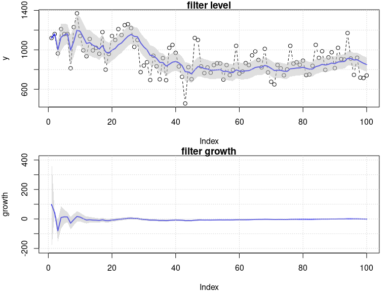
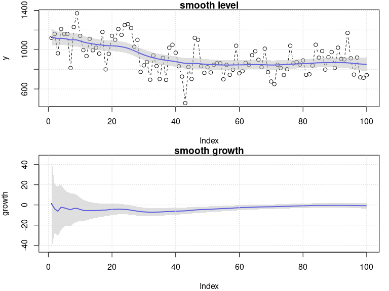

<!-- README.md is generated from README.Rmd. Please edit that file -->

# RBATS

> The `RBATS` is an experimental R package for Bayesian Dynamic Models.
> The functionaly is based on the [Bayesian Forecasting and Dynamic
> Models](http://www2.stat.duke.edu/~mw/West&HarrisonBook/) from West
> and Harrison (1997). The currently version of the package implements
> the Dynamic Linear Models and Dynamic Generalized Exponential Growth
> Models.

## Development cycle

This package is early in development. Changes and additional
functionality may occur. The **development** version can be installed
from GitHub using:

``` r
# install.packages("remotes")
remotes::install_github("AndrMenezes/RBATS", build_vignettes = TRUE)
```

## Quick overview

The package is structured based on S3 classes objects. The following
functions created the two main objects of the package:

-   `dlm`: create and object of class `dlm` for Dynamic Linear Models.

-   `dgegm`: create and object of class `dgegm` for Dynamic Generalized
    Exponential Growth Models.

Each of this class objects have the following methods:

-   `update_moments`: update the moments of state parameters for `dlm`
    and `dgegm` objects.

-   `fit`: performs the filtering and smoothing for `dlm` and `dgegm`
    objects.

-   `forward_filter`: performs the filtering for `dlm` and `dgegm`
    objects.

-   `backward_smoother`: performs the smoothing for `dlm` and `dgegm`
    objects.

-   `forecast`: performs the marginal forecast for `dlm` and `dgegm`
    objects.

-   `logLik`: returns the predictive log-likelihood for `dlm` and
    `dgegm` objects.

-   `plot`: returns base plots of filter and/or smooth predictive and
    posterior distribution for `dlm` and `dgegm` objects.

First, we define the model using the `dlm` function, then we fit the
model through the `fit` method.

``` r
library(RBATS)
(model_object <- dlm(polynomial_order = 2, discount_factors = list(polynomial = 0.95)))
#> 
#> Bayesian Dynamic Linear Model 
#> 
#> Call:
#> dlm(polynomial_order = 2, discount_factors = list(polynomial = 0.95)) 
#> 
#> Model specfication:
#>   parameter discount_factors
#> 1     level             0.95
#> 2    growth             0.95
#> 
#> Variance law: identity
(fitted_model <- fit(model_object, y = c(Nile)))
#> 
#> Bayesian Dynamic Linear Model 
#> 
#> Call:
#> dlm(polynomial_order = 2, discount_factors = list(polynomial = 0.95)) 
#> 
#> Model specfication:
#>   parameter discount_factors
#> 1     level             0.95
#> 2    growth             0.95
#> 
#> Variance law: identity 
#> 
#> Posterior parameters at time 100:
#>   parameter        mean    variance
#> 1     level 850.6569581 1884.683698
#> 2    growth  -0.7757924    2.860733
#> 
#> Predictive log-likelihod: -659.4536
```

Basics visual inspects can be accessed using the `plot` method.

``` r
plot(fitted_model, what = "posterior", type = "filter")
```

<!-- -->

``` r
plot(fitted_model, what = "posterior", type = "smooth")
```

<!-- -->

The `fit` method returns the `dlm` model (`model`) with the most updated
prior and posterior. Then, we can use the most recent model to obtain
forecast.

``` r
model_object <- fitted_model$model
forecast(model_object, horizon = 5)
#> 
#> Forecast from Bayesian Dynamic Linear Model 
#> 
#> Call:
#> forecast.dlm(object = model_object, horizon = 5) 
#> 
#> 5-step ahead forecast distribution parameters:
#>     t horizon     mean variance  df ci_lower ci_upper
#> 1 101       1 849.1054 20527.81 101 611.2568 1086.954
#> 2 102       2 848.3296 20653.71 101 609.7528 1086.906
#> 3 103       3 847.5538 20785.63 101 608.2162 1086.891
#> 4 104       4 846.7780 20923.58 101 606.6476 1086.908
#> 5 105       5 846.0022 21067.55 101 605.0471 1086.957
```

One of the main advantages of DLM are the sequential learning, which
means that we can update the model when new observation came without
need the past information. The `update_moments` method is used for this
purpose.

``` r
set.seed(1212)
y_new <- rnorm(1, mean(Nile), sd = 1)
model_object
#> 
#> Bayesian Dynamic Linear Model 
#> 
#> Call:
#> dlm(polynomial_order = 2, discount_factors = list(polynomial = 0.95)) 
#> 
#> Model specfication:
#>   parameter discount_factors
#> 1     level             0.95
#> 2    growth             0.95
#> 
#> Variance law: identity 
#> 
#> Posterior parameters at time 100:
#>   parameter        mean    variance
#> 1     level 850.6569581 1884.683698
#> 2    growth  -0.7757924    2.860733
#> 
#> Predictive log-likelihod: -659.4536
model_object_updated <- update_moments(model_object, y = y_new)
model_object_updated
#> 
#> Bayesian Dynamic Linear Model 
#> 
#> Call:
#> dlm(polynomial_order = 2, discount_factors = list(polynomial = 0.95)) 
#> 
#> Model specfication:
#>   parameter discount_factors
#> 1     level             0.95
#> 2    growth             0.95
#> 
#> Variance law: identity 
#> 
#> Posterior parameters at time 101:
#>   parameter        mean   variance
#> 1     level 856.9937566 1866.85487
#> 2    growth  -0.5776705    2.82176
#> 
#> Predictive log-likelihod: -665.452
```

## Contribute

The `RBATS` is still an experimental `R` package. I am inspired in the
great [`PyBATS`](https://lavinei.github.io/pybats/) python package from
[Isaac Lavine](https://www.linkedin.com/in/isaac-lavine-70495929/) and
[Andrew Cron](https://www.linkedin.com/in/andrewjcron/). I hope in
future `RBATS` became a robust tool as well as `PyBATS`.

Please, any suggestions and contributions are more than welcome. Feel
free to open issues, pull requests and/or forks. Thanks!

## Other R packages

Other R packages that can be used for Dynamic Linear Model or also known
State Space Models are:

-   [`dlm`](https://cran.r-project.org/web/packages/dlm/index.html) by
    Giovanni Petris and Wally Gilks.

-   [`bsts`](https://cran.r-project.org/web/packages/bsts/index.html) by
    Steven L. Scott.

-   [`KFAS`](https://cran.r-project.org/web/packages/KFAS/index.html) by
    Jouni Helske.

-   [`bssm`](https://cran.r-project.org/web/packages/bssm/index.html) by
    Jouni Helske and Matti Vihola.
